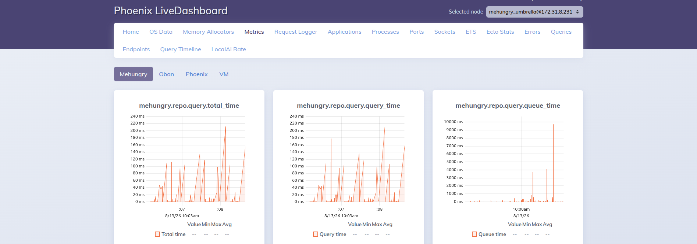
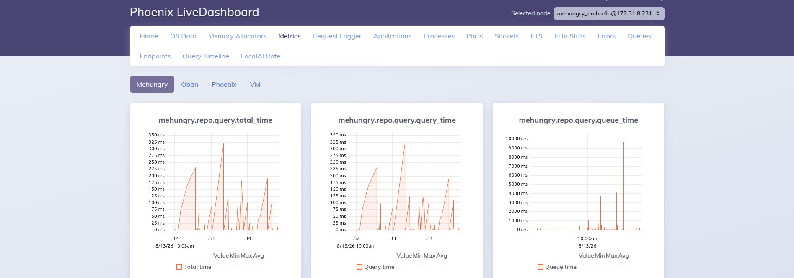
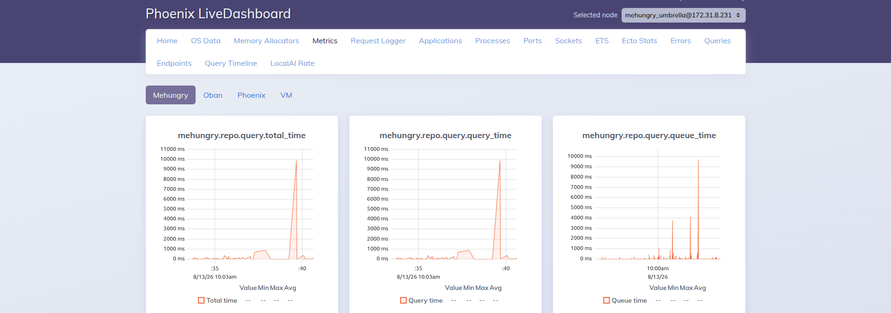
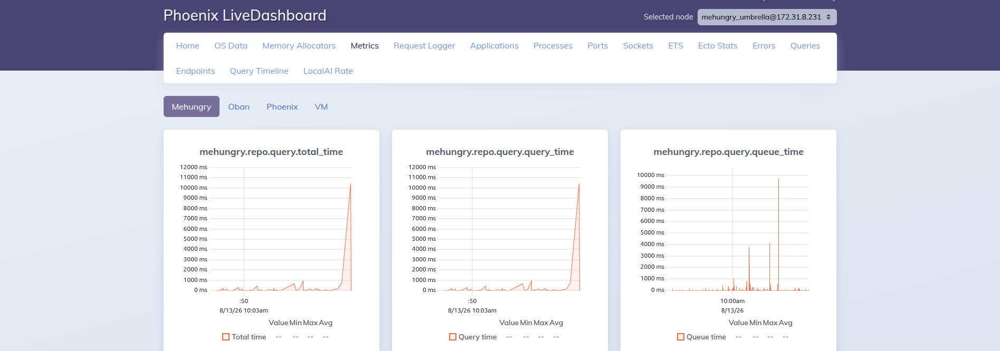

# Oban Production Failure Diagnostics

Analysis of why Oban jobs succeed reliably on a local laptop but fail much more
often on the deployed server. This is a **configuration-based analysis** — see
[§7 Confirm before acting](#7-confirm-before-acting) for how to verify which
cause actually dominates in your logs before changing anything.

## Environment facts (as deployed)

| Dimension | Local laptop | Production (AWS Fargate) |
|---|---|---|
| CPU | 8–16 real cores | **1 vCPU** (`task-definition.json` `cpu: "1024"`) |
| Memory | 16–32 GB | **3 GB** (`memory: "3072"`) |
| Postgres | localhost, sub-ms latency | RDS over the network (per-query latency + connection held longer) |
| DB pool | `pool_size: 10` (dev) | `POOL_SIZE` **unset → defaults to 10** (`config/runtime.exs:129`) |
| BEAM schedulers | matches real cores | **not pinned** — `rel/vm.args.eex` is all commented out |
| Load | just you | real web traffic + LiveView + Presence, all sharing the same resources |

Total Oban job slots configured (`config/config.exs:127`):

```
default: 10 + mailers: 5 + ai_agents: 2 + imports: 2 + seed_imports: 2  =  21 concurrent jobs
```

Those 21 job slots **plus** every Phoenix web request, LiveView process, and
Presence write all check out from **one pool of 10 DB connections**.

---

## Production evidence — LiveDashboard Ecto metrics

Four screenshots from the prod node `mehungry_umbrella@172.31.8.231`
(LiveDashboard → Metrics → *Mehungry* tab, 2026-08-13 ~10:03 UTC) turn the
pool-starvation hypothesis from inference into **observed fact**. Each shot shows
three Ecto repo metrics side by side:

- `mehungry.repo.query.query_time` — time the query spent **executing** in Postgres.
- `mehungry.repo.query.queue_time` — time the query spent **waiting for a free
  pooled connection** before it could run. On a healthy pool this is ~0.
- `mehungry.repo.query.total_time` — queue + query.

### What the metrics show

| Screenshot | Window | `query_time` peak | `queue_time` peak | Reading |
|---|---|---|---|---|
|  `queue_time_01.png` | 10:06–10:08 | ~220 ms | **~9,500 ms** | DB fast, but queries wait ~9.5 s for a connection |
|  `queue_time_02.png` | 10:32–10:34 | ~325 ms | **~9,500 ms** | same pattern, sustained |
|  `queue_time_03.png` | 10:35–10:40 | ~10,000 ms | ~4,000–9,500 ms | execution *also* blows out to ~10 s under contention |
|  `queue_time_04.png` | ~10:50 | ~10,500 ms | ~4,000–9,500 ms | worst case: total_time ≈ 10.5 s |

### Why this is a smoking gun for root cause #1

1. **`queue_time` repeatedly spikes to 4,000–10,000 ms.** Queue time *is* the
   time a query sits waiting for the connection pool to hand it a connection. A
   healthy pool sits near 0 ms. Multi-second queue times mean **all 10
   connections are busy and queries are stacking up behind them** — the pool is
   the bottleneck, precisely as predicted in root cause #1.

2. **When `queue_time` is high but `query_time` is only ~200–325 ms
   (screenshots 01–02), the database itself is healthy.** The queries are quick;
   they just can't get a connection. This rules out "slow queries / bad indexes"
   as the primary problem — the shortage is *connections*, not DB horsepower.

3. **~10 s is exactly timeout territory.** Ecto's default checkout path abandons
   a query once the pool queue stays saturated, and Postgrex/DBConnection call
   timeouts sit in the 5–15 s range. Queue/total times pinned near 10 s are the
   point at which the waiting process — an Oban job or a web request — gives up
   with `DBConnection.ConnectionError`. **That is the Oban failure being
   reported.**

4. **Screenshots 03–04 show the compounding spiral.** Once contention is severe,
   even `query_time` climbs to ~10 s: on the single throttled vCPU the process
   holding a connection can't get scheduled to finish, so it holds its
   connection *longer*, which starves everyone else further (head-of-line
   blocking). This is root cause #1 and root cause #3 (CPU starvation) feeding
   each other.

**Bottom line from the dashboard:** the DB is fast when it runs; jobs fail
because they wait up to ~10 s for one of only 10 connections and then time out.
This promotes root cause #1 from "most likely" to **confirmed**, and the §8
drafted changes (raise pool to 18, cap Oban concurrency to 11, add a vCPU) target
exactly this gap.

---

## Root causes (ranked by likelihood)

### 1. DB connection-pool starvation — CONFIRMED primary cause

> Confirmed by the LiveDashboard `queue_time` spikes of 4,000–10,000 ms above —
> see [Production evidence](#production-evidence--livedashboard-ecto-metrics).

- 21 Oban slots + web traffic contend for **10** connections.
- Locally this never bites: low concurrency, and localhost Postgres returns each
  query in well under a millisecond, so a connection is checked out and returned
  almost instantly — the pool is effectively never empty.
- In production every query holds its connection **longer** (RDS is a network
  hop), real web traffic is competing, and a single vCPU can't drain the pool
  fast. When all 10 connections are busy, new checkouts queue. Ecto's defaults
  (`queue_target: 50ms`, `queue_interval: 1000ms`) start **failing** checkouts
  once the queue stays saturated.
- The job process then crashes with
  `DBConnection.ConnectionError ... (queue timeout / connection not available)`.
  Oban records it as an error and retries.
- This failure rate scales with contention — which is exactly the reported
  symptom: "worse on the server with less resources and real load."

### 2. BEAM scheduler oversubscription on Fargate — likely secondary cause

- `rel/vm.args.eex` has **no `+S` / `+SDcpu` / `+sbwt` flags** (all commented out).
- The container is capped at 1 vCPU by the cgroup, but the BEAM sizes its
  scheduler pool from the CPU count it *detects*, which in a throttled Fargate
  container does **not** equal the 1-vCPU quota. So it runs more schedulers than
  the CPU quota allows.
- The Linux CFS quota then throttles those schedulers mid-run. A scheduler
  frozen while holding a job means DB calls, `GenServer.call`s, and socket reads
  blow their timeouts → `:timeout`, gen_server call timeouts, checkout timeouts.
- Default scheduler **busy-wait** (`+sbwt`) also burns the scarce single vCPU
  spinning instead of doing job work. On a laptop with real cores this is
  invisible; on 1 throttled vCPU it directly starves job execution.

### 3. CPU starvation of long / CPU-heavy jobs

- `AI.Client` uses a **90 s** `recv_timeout` (`ai/client.ex:16`) with 3 retries.
  Long-running jobs (RecipeAgent tool loops, translations, image gen, seed
  imports, PubTator/PMC parsing) all fight over one vCPU.
- Under contention the job process may not get scheduled in time to read the
  HTTP socket before the timeout fires → `AI.Client` exhausts retries →
  `{:error, ...}` → job failure. Locally there's always a free core, so the
  socket is read the instant data arrives.

### 4. Memory pressure / OOM at 3 GB

- Up to 21 job processes plus AI payloads, large PubTator/PMC JSON, embedding
  batches, and seed files can spike memory past 3 GB.
- An OOM kill (or BEAM allocator failure) leaves jobs stuck in `executing`.
  `Oban.Plugins.Lifeline` (`rescue_after: 30 min`, `config.exs:112`) only
  rescues them after **30 minutes** — so they look like long stalls *and*
  re-run, adding more load. A laptop with 16–32 GB never hits this.

### 5. Retry amplification (a feedback loop, not a root cause)

- Most workers are `max_attempts: 3`. A single transient starvation blip becomes
  **3 executions**, adding load and making the contention worse — a positive
  feedback loop that turns a small resource shortfall into a failure spike.
- Conversely, `max_attempts: 1` workers (`nutritionist_agent_worker`,
  `pipeline_watchdog_worker`, `branded_ingredient_delete_worker`) fail
  **permanently** on any single blip — no second chance.

---

## Why it's fine locally but not in prod, in one line

Locally, spare CPU + spare RAM + sub-millisecond localhost Postgres mean the
pool never empties, schedulers never throttle, and timeouts never fire. In prod,
1 vCPU + 3 GB + networked RDS + real traffic remove all three margins at once, so
the same jobs tip over into pool timeouts, scheduler-throttle timeouts, HTTP
timeouts, and occasional OOM.

---

## Recommended fixes (cheapest / highest-leverage first)

1. **Give the BEAM more room to breathe — raise the Fargate task to 2 vCPU**
   (`cpu: "2048"`). Single vCPU is very tight for web + 21 job slots. Biggest,
   simplest win; low risk.

2. **Fix the pool vs. concurrency mismatch.** Either:
   - raise `POOL_SIZE` (e.g. `15`–`20`) in the ECS env, **and/or**
   - lower total Oban concurrency so `peak Oban checkouts + web checkouts ≤ pool_size`
     with headroom (e.g. `default: 5, imports: 1, ai_agents: 1`).
   - Best practice: size `pool_size ≥ concurrent Oban jobs + expected web
     concurrency`. Right now it's 10 vs a theoretical 21+web.

3. **Pin BEAM schedulers to the cgroup and kill busy-wait.** Add to
   `rel/vm.args.eex` (or `ELIXIR_ERL_OPTIONS`), matching the task's vCPU count:
   ```
   +S 2:2
   +sbwt none
   +sbwtdcpu none
   +sbwtdio none
   ```
   (Use `+S 1:1` if you keep 1 vCPU, `+S 2:2` if you move to 2.) This stops
   scheduler throttling and stops the idle CPU burn.

4. **Cap memory-heavy queues** (`imports`, `seed_imports`, `ai_agents`) and/or
   raise task memory. Consider lowering `Lifeline` `rescue_after` so orphaned
   jobs recover in minutes, not 30 min.

5. **Consider a dedicated Oban repo/pool** so background jobs can't starve web
   requests of DB connections (Oban supports a separate `Repo`).

6. **Add jitter/backoff** on the `max_attempts: 3` workers so retries don't
   thundering-herd back onto an already-contended node.

---

## 7. Confirm before acting

This analysis is inferred from config, not from the actual production error
strings. Confirm *which* failure mode dominates first — the fix differs per mode:

- **Which error?** Look at `oban_jobs.errors` in prod:
  ```sql
  SELECT state, worker, left(errors::text, 300) AS err, count(*)
  FROM oban_jobs
  WHERE state IN ('retryable','discarded')
  GROUP BY 1,2,3 ORDER BY 5 DESC LIMIT 30;
  ```
  - `DBConnection.ConnectionError`/`queue timeout` → cause **#1** (pool).
  - `:timeout` / gen_server call timeouts / random slowness → cause **#2/#3**.
  - jobs stuck in `executing` then rescued → cause **#4** (OOM).
- **Already confirmed via the dashboard:** the `mehungry.repo.query.queue_time`
  metric (LiveDashboard → Metrics → Mehungry) is the fastest live check — the
  4–10 s spikes captured above are the pool-starvation signature. Watch this
  chart flatten toward ~0 after deploying the §8 changes.
- **Also check** the app's own DIY error tracker (`error_events`) and CloudWatch
  for `[SlowQuery]` / `[SlowRequest]` warnings and ECS OOM / CPU-throttle metrics.
- **Cross-check timing:** do failures cluster during high web traffic or during
  the science-pipeline (`imports`) runs? That tells you whether web or jobs are
  the ones exhausting the pool.

---

## 8. Drafted changes (concrete diffs)

The changes below are a coherent set: they move the task to 2 vCPU / 4 GB, pin
the BEAM to that CPU count, right-size the DB pool, and cap total Oban
concurrency so `Oban peak + web ≤ pool_size` with headroom. Apply them together
— they were sized against each other. Roll out behind a deploy you can watch.

**Pool math after these changes:**
`default 5 + mailers 3 + ai_agents 1 + imports 1 + seed_imports 1 = 11` job
slots, `POOL_SIZE = 18` → ~7 connections of headroom for web/LiveView/Presence.

### 8.1 `task-definition.json` — 2 vCPU, 4 GB, tuning env vars

```diff
     "requiresCompatibilities": ["FARGATE"],
-    "cpu": "1024",
-    "memory": "3072",
+    "cpu": "2048",
+    "memory": "4096",
     "runtimePlatform": {
```

Add the tuning vars to the container `environment` array (`~line 34`):

```diff
             "environment": [
                 { "name": "SOME_APP_SSL_KEY_PATH", "value": "priv/cert/SSL_PrivateKEY_www_m3hungry_com.pem" },
                 { "name": "SOME_APP_SSL_CERT_PATH", "value": "priv/cert/SSL_CSR_www_m3hungry_com.pem" },
-                { "name": "AWS_ASSETS_BUCKET_NAME", "value": "mehungry-main-bucket" }
+                { "name": "AWS_ASSETS_BUCKET_NAME", "value": "mehungry-main-bucket" },
+                { "name": "POOL_SIZE", "value": "18" },
+                { "name": "ERL_AFLAGS", "value": "+S 2:2 +sbwt none +sbwtdcpu none +sbwtdio none" }
             ],
```

Notes:
- `ERL_AFLAGS` is read by the BEAM at boot, so it works even though
  `rel/vm.args.eex` is templated — no image rebuild required to retune it. (If
  you prefer baking it into the release instead, use §8.3 and drop this env var.)
- Keep `+S N:N` equal to the task's vCPU count. If you stay on 1 vCPU, use
  `+S 1:1`; if you later go to 4 vCPU, `+S 4:4`.
- `memory` bumped to 4 GB to absorb the OOM risk from §4. Adjust if cost matters;
  4 GB is the smallest step that pairs with 2048 CPU under Fargate's allowed
  cpu/memory combinations.

### 8.2 `config/config.exs` — cap total Oban concurrency

```diff
   queues: [
-    default: 10,
-    mailers: 5,
-    ai_agents: 2,
-    imports: 2,
+    default: 5,
+    mailers: 3,
+    ai_agents: 1,
+    imports: 1,
     # Bulk USDA seed-file imports get their own slots so a full-bucket "Load
     # ingredients" run can't starve behind the long-running, self-resuming
     # science pipeline (literature crawl / PubTator / candidate derivation) that
     # shares the 2-slot `:imports` queue. Capped at 2 to bound DB write pressure.
-    seed_imports: 2
+    seed_imports: 1
   ]
```

Trade-off: `imports: 1` serializes the science pipeline (crawl / PubTator /
derivation) — acceptable because it's self-resuming and latency-tolerant.
`ai_agents: 1` serializes recipe generation/translation/image jobs; if the daily
2am batch needs parallelism, keep `ai_agents: 2` and drop `default` to `4`
instead (total still 11). Update the `## Oban Queues` block in `CLAUDE.md` to
match whichever numbers you ship.

### 8.3 `rel/vm.args.eex` — bake scheduler pinning into the release (alternative to the `ERL_AFLAGS` env var)

Use this **instead of** the `ERL_AFLAGS` line in §8.1 if you'd rather version the
flags with the release than in the task definition:

```diff
 ## Increase number of concurrent ports/sockets
 ##+Q 65536

 ## Tweak GC to run more often
 ##-env ERL_FULLSWEEP_AFTER 10
+
+## Pin schedulers to the container's cgroup CPU quota (Fargate 2 vCPU) and stop
+## scheduler busy-wait from burning CPU on a constrained core. Must match the
+## task-definition `cpu` value (2048 → 2 vCPU → 2:2).
++S 2:2
++sbwt none
++sbwtdcpu none
++sbwtdio none
```

Pick **one** of §8.1's `ERL_AFLAGS` or §8.3 — don't set the flags in both places.
The env var is easier to retune without a rebuild; the vm.args version is
versioned with the code.

### 8.4 (Optional) `config/runtime.exs` — raise the pool default

Belt-and-suspenders so the app is safe even if `POOL_SIZE` is ever unset:

```diff
   config :mehungry, Mehungry.Repo,
     url: database_url,
-    pool_size: String.to_integer(System.get_env("POOL_SIZE") || "10"),
+    pool_size: String.to_integer(System.get_env("POOL_SIZE") || "18"),
     socket_options: maybe_ipv6,
```

Confirm your RDS instance's `max_connections` comfortably exceeds
`POOL_SIZE × number_of_ECS_tasks` (+ the migrator task + any admin connections)
before raising the pool — otherwise you trade an app-side queue timeout for a
Postgres-side "too many connections" error.

### 8.5 Rollout order

1. Ship §8.2 (queue caps) + §8.1 CPU/memory/env in one deploy — these are the
   high-leverage, low-risk changes.
2. Watch `oban_jobs` error rate and CloudWatch CPU/memory for a day.
3. Only then tune further (scheduler flags via §8.3 if you prefer, pool via §8.4).

### 8.6 Verify after deploy

```sql
-- error rate should drop; watch for the queue-timeout signature disappearing
SELECT state, count(*) FROM oban_jobs GROUP BY 1;
```

Inside a running prod node, confirm the BEAM picked up the scheduler flags:

```elixir
:erlang.system_info(:schedulers_online)   #=> should equal the vCPU count (2)
```

> ⚠️ **`bin/mehungry_umbrella remote` is currently broken in prod** — see
> [§11.2](#112-remote-console-is-broken----and-how-to-get-in-anyway). Use
> `eval` (or the [Oban Web UI](#111-oban-web-ui-at-oban), which needs no console)
> until the release config is fixed.

---

## 9. Pool sizing rationale (and how it scales with more app tasks)

Why `POOL_SIZE = 18`, and — critically — why that number is **not** safe to
copy-paste once you run more than one ECS task. Read this before scaling out.

### 9.1 What `pool_size` actually is

It's the number of **persistent TCP connections** a single BEAM node holds open
to Postgres. A connection is checked out the instant a query runs and returned
the instant it finishes — it is *not* per-request or per-job. So the pool is
sized to **peak concurrent in-flight queries**, not to user count or throughput.

### 9.2 It's a valve between two scarce resources

```
   too small                      just right                    too big
──────────────┼───────────────────────┼───────────────────────────┼─────────
 app-side queueing            no queueing, RDS               RDS-side exhaustion
 (queue_time ↑ — the          comfortably served            (too many backends,
  ~10s spikes in §Evidence)                                  memory/CPU pressure,
                                                             "too many connections")
```

- **Undersized** → demand for connections exceeds supply → queries wait in an
  app-side queue → that wait *is* the `queue_time` metric (the confirmed 4–10 s
  spikes). The DB is fast; queries just can't get a connection.
- **Oversized** → you don't remove the bottleneck, you push it *downstream* into
  Postgres: dozens of backends hammer a small RDS at once (context-switching,
  lock contention, memory blowup), or you hit the hard `max_connections` ceiling
  and get outright `FATAL: too many connections`.

**Goal: the smallest pool that eliminates app-side queueing — not the largest
RDS will tolerate.**

### 9.3 The demand side — where 18 comes from

Size the pool to peak concurrent connection demand on **one** node:

```
peak demand ≈ concurrent Oban job slots + concurrent web/LiveView checkouts
```

- Oban after §8.2 = **11** job slots (all query-heavy — assume all want a
  connection at once).
- Web / LiveView / Presence adds bursty demand on top.

`11 + ~7 headroom = 18`. Deliberately just above the Oban ceiling with a cushion
for web — not a round "make it 50."

> **Little's Law lens:** `connections_needed ≈ arrival_rate × avg_query_duration`.
> A slow query is more corrosive than a small pool — doubling avg query time
> doubles the pool you need. Fix the 10 s query before adding 10 connections.

### 9.4 The supply side — RDS's ceiling is memory-derived

A Postgres connection is a separate OS **backend process** on the RDS box
(~5–10 MB each, its own `work_mem`). That's why Postgres caps them. RDS derives
`max_connections` from **instance memory**, via the default parameter group:

```
max_connections = LEAST({DBInstanceClassMemory / 9531392}, 5000)
```

| RDS instance | RAM | ~default `max_connections` |
|---|---|---|
| **db.t4g.micro ← this deployment** | **1 GB** | **~112** (verify: often lands ~80–112) |
| db.t3.micro | 1 GB | ~112 |
| db.t3.small | 2 GB | ~225 |
| db.t3.medium | 4 GB | ~450 |

So the ceiling scales with **how much RAM you paid RDS for**. A small instance
genuinely has few connections to hand out.

> **This deployment runs `db.t4g.micro` (1 GiB RAM, 2 burstable Graviton vCPU)** —
> the tightest tier. The formula gives `~112`, but small instances frequently
> land lower (~80–112) because `DBInstanceClassMemory` is net of OS overhead.
> **Confirm the real number with `SHOW max_connections;`** before trusting the
> margins below. On a 1 GiB DB there is also a *second*, softer limit: every
> backend (~5–10 MB) competes with Postgres's own `shared_buffers`/cache (~25 %
> of RAM ≈ 256 MB here), so a large pool doesn't just risk the hard cap — it
> steals RAM the DB wants for caching. This is an independent reason to keep the
> pool modest on a micro, which the §8.2 Oban cap (11 slots) already supports.

### 9.5 The budget is shared and multiplied — the scaling math

Your pool is **not** the only consumer, and it multiplies by task count:

```
total connections against RDS =
    POOL_SIZE × (number of ECS app tasks)      ← the term that explodes on scale-out
  + migrator task pool (during deploys)
  + psql / admin / BI / monitoring sessions
  + rds.superuser_reserved_connections (default 3)
```

Keep the total **under ~80 % of `max_connections`**, and leave room for a
**rolling-deploy overlap** — during a deploy old + new tasks are both connected,
briefly ~doubling the app's footprint.

**Worked scaling table** (`POOL_SIZE = 18`, ~+5 for migrator/admin overhead):

| App tasks | Steady conns (`18 × N + 5`) | Mid-deploy (~old+new) | Safe on db.t3.micro (112)? | Safe on db.t3.small (225)? |
|---|---|---|---|---|
| 1 | ~23 | ~41 | ✅ | ✅ |
| 2 | ~41 | ~77 | ✅ (tight) | ✅ |
| 4 | ~77 | ~149 | ❌ mid-deploy blows past 112 | ✅ |
| 6 | ~113 | ~221 | ❌ | ⚠️ ~98 % — no headroom |
| 8 | ~149 | ~293 | ❌ | ❌ |

**Reading of the table:** at 1–2 tasks, `POOL_SIZE 18` is comfortable on even a
micro. By **4 tasks** a rolling deploy already breaches a t3.micro's ceiling; by
**6 tasks** you're saturating a t3.small. The `POOL_SIZE × tasks` product — not
the app's traffic — is what forces the next decision.

> **Verdict for this deployment (`db.t4g.micro`, ~112 ceiling, 1 ECS task):**
> `POOL_SIZE 18` sits at **~23 steady (~20 %)** and **~41 mid-deploy (~37 %)** —
> comfortable, with real headroom. Confirmed safe.
>
> - **You can go to 2 tasks** (~41 steady / ~77 mid-deploy ≈ 69 %) — but that is
>   the practical ceiling on a micro, with little slack for failover storms.
> - **3+ tasks on a t4g.micro is not viable** with an 18-wide pool: a rolling
>   deploy would approach or exceed `max_connections`. At that point do §9.6 —
>   shrink the per-task pool first, and add **RDS Proxy** (or move to
>   `db.t4g.small`, 2 GB → ~225) before scaling out further.
>
> Because the instance is only 1 GiB, prefer the *shrink-per-task-pool* and
> *RDS Proxy* routes over just raising the cap — connection RAM is scarce here.

### 9.6 How to scale out safely (in order of preference)

When you add app tasks, do **not** keep `POOL_SIZE` at 18 blindly. Options, best
first:

1. **Shrink `POOL_SIZE` per task as you add tasks.** Total demand is roughly
   fixed by real query concurrency, not by how many boxes you spread it over. If
   1 task needed 18, 3 tasks often need ~6–8 *each* (Oban concurrency can even be
   set lower per node, or pinned to one node). Re-derive from §9.3 per task, not
   from the old single-node number.
2. **Introduce a connection proxy — the real horizontal-scale answer.** Put
   **RDS Proxy** (or PgBouncer) in front: each app node keeps a large *logical*
   pool, the proxy multiplexes them down to a small number of *real* Postgres
   backends. This **decouples app concurrency from Postgres process count** — the
   only way to add many nodes without the `POOL_SIZE × tasks` product exploding.
3. **Scale the RDS instance up** (more RAM → higher `max_connections`) and/or
   bump `max_connections` in the parameter group. Blunt and costly, and the
   parameter change **requires a reboot** — it is not a hot knob, so don't rely
   on it during an incident.
4. **Split Oban onto its own smaller pool / dedicated repo** so background-job
   connections are budgeted separately from web, and a job burst can't starve
   web checkouts (or vice versa).

### 9.7 RDS-specific gotchas

- **`max_connections` change needs a reboot** — plan `pool × tasks` against the
  *current* ceiling, not an aspirational one.
- **Failover connection storms** — on an RDS failover every pooled connection
  reconnects at once; large pool × many tasks can stampede the freshly-promoted
  instance. Smaller pools are gentler.
- **Idle connections still cost** — an idle pooled connection is a live backend
  holding memory. Oversizing "just in case" is not free at low traffic.

### 9.8 The two commands that tell you which way to move

```sql
SHOW max_connections;                                          -- your real ceiling
SELECT count(*), state FROM pg_stat_activity GROUP BY state;   -- current usage vs ceiling
```

- `queue_time` spiking (LiveDashboard, §Evidence) → pool **too small**, raise it
  (or fix slow queries / add a proxy).
- `pg_stat_activity` count nearing `max_connections` → pool **too big** for the
  current instance × task count, shrink it or add a proxy / scale RDS.

**One-line model:** `pool_size` is a valve between app concurrency and RDS's
memory-bound `max_connections`; size it to the minimum that removes app-side
queueing, then verify `POOL_SIZE × task_count + overhead` stays under ~80 % of
`max_connections` — and re-verify that product **every time** you change task
count or RDS instance class.


---

## 10. Erlang VM scheduler tuning & why we left `rel/vm.args.eex` untouched

We applied the scheduler flags via `ERL_AFLAGS` in `task-definition.json` (§8.1)
and **deliberately did not edit `rel/vm.args.eex` (§8.3)**. This section explains
that choice and lays out the full menu of VM tuning knobs mapped to the actual
ECS task resources, so future changes are principled rather than cargo-culted.

### 10.1 The problem restated — cgroup quota vs. BEAM scheduler count

Fargate caps the container's CPU via a cgroup (`cpu: 2048` → 2 vCPU). But the
BEAM, by default, sizes its scheduler pool from the number of logical processors
it *detects*, and **it does not read the cgroup CPU quota** (still true as of
OTP 26 — there is no automatic CFS-quota-to-scheduler mapping). In a container it
can therefore start more schedulers than the quota allows. The kernel then
throttles them mid-run (CFS), freezing whatever a scheduler was holding — a DB
call, a `GenServer.call`, a socket read — until its next slice. Those freezes are
how root cause #2/#3 turn into timeouts. **Pinning the scheduler count to the
vCPU allocation is the fix**, and it must therefore *track the `cpu` value*.

### 10.2 Why `ERL_AFLAGS` (task definition), not `rel/vm.args.eex`

Both mechanisms feed the same flags to the VM; the difference is **when and where
they're set**, and that's the whole decision:

| | `rel/vm.args.eex` (§8.3) | `ERL_AFLAGS` env var (§8.1, chosen) |
|---|---|---|
| Rendered | EEx **at release-build time** — baked into the image | Read by the VM **at boot**, from the environment |
| To retune | rebuild image → push to ECR → redeploy | edit `task-definition.json`, register revision, redeploy — **no rebuild** |
| Lives next to | the code | **the `cpu`/`memory` values it must stay in sync with** |
| Coupling risk | scheduler count drifts from `cpu` in a *different* file | flag and the resource it depends on are in the **same file** |

The deciding factor is **coupling**: `+S N:N` is a function of the ECS `cpu`
allocation, and that allocation lives in `task-definition.json`. Putting the flag
in the *same file* as the number it depends on makes "change the vCPU → change
the scheduler count" a single, local, reviewable edit. Splitting them across
`task-definition.json` (cpu) and `rel/vm.args.eex` (scheduler count) invites the
classic drift where someone bumps the task to 4 vCPU and the VM stays pinned at
`2:2`. Bonus: `ERL_AFLAGS` retunes without a Docker rebuild, so scheduler
experiments are a task-revision away, not a full CI cycle.

We also **avoided setting the flags in both places** — duplicated, possibly
conflicting VM args is its own footgun. One home only.

> Note on templating: `rel/vm.args.eex` is rendered by EEx at *assembly* time, so
> it can't interpolate the container's runtime `cpu` value — another reason the
> resource-coupled flag belongs in the task definition, which *is* evaluated per
> deployment.

### 10.3 The scheduler flags that matter, mapped to ECS resources

What we set — `+S 2:2 +sbwt none +sbwtdcpu none +sbwtdio none` — and the wider menu:

- **`+S Schedulers:SchedulersOnline`** — normal scheduler threads (total:online).
  Set both to the **vCPU count** (`cpu_units / 1024`). This is the core fix.
- **`+SDcpu N` / `+SDPcpu p%`** — **dirty CPU schedulers** (default = number of
  normal schedulers). Long CPU-bound NIFs/BIFs run here. On a constrained
  container leave them coupled to the vCPU count too, so dirty work can't
  oversubscribe the cores either. (We rely on the default tracking `+S`; set
  `+SDcpu 2` explicitly if you want it pinned independently.)
- **`+SDio N`** — **dirty IO schedulers** (default 10). These are for blocking IO
  NIFs and are cheap/mostly-parked; the default 10 is usually fine even on a
  small box. Lower only if you see contention.
- **`+sbwt none +sbwtdcpu none +sbwtdio none`** — **scheduler busy-wait**. By
  default (`medium`) an idle scheduler *spins* for a while before sleeping, to
  cut wake-up latency. On a scarce 2-vCPU box that spinning **burns the exact
  cores job work needs** for no benefit — set to `none` on normal, dirty-CPU, and
  dirty-IO schedulers. (This matters most on *burstable* instances where spinning
  drains CPU credits; the Fargate app task has dedicated vCPU, so here it "only"
  wastes the scarce cores — still worth eliminating.)
- **`+sbt` (bind type, e.g. `db`)** — pins schedulers to specific logical cores.
  **Intentionally NOT set.** Core-binding assumes you own the physical cores; in a
  shared/throttled container you don't, and binding can hurt. Leave unbound.
- **`+A N`** — async thread pool for file IO (default 1 in modern OTP). Default
  is fine; raise only for heavy file IO workloads (not ours).

### 10.4 Keep `+S` in lockstep with the `cpu` value

The single rule to remember when resizing the task:

| Fargate `cpu` | vCPU | scheduler flag |
|---|---|---|
| `1024` | 1 | `+S 1:1` |
| `2048` (current) | 2 | `+S 2:2` |
| `4096` | 4 | `+S 4:4` |

`+S N:N` where **N = `cpu` ÷ 1024**. Changing one without the other re-introduces
the oversubscription this whole section exists to prevent. Because both values
now live in `task-definition.json`, that's a one-file edit.

### 10.5 What *does* belong in `rel/vm.args.eex`

"Leave it untouched" is specific to the *resource-coupled* flags — it is not a
blanket rule. `rel/vm.args.eex` is the right home for **deployment-invariant**
tuning that's the same wherever the release runs and that you want versioned with
the code, e.g.:

- `+Q 65536` — raise the max concurrent ports/sockets (already stubbed as a
  comment in the file).
- `+P` / `+e` / `+t` — max processes / ETS tables / atoms, if you ever outgrow
  defaults.
- distribution buffer / GC policy flags that don't depend on CPU count.

Rule of thumb: **flag depends on the ECS task's CPU/memory → task definition;
flag is invariant to where it runs → `vm.args.eex`.**

### 10.6 Memory-side VM knobs for the 4 GB constraint (optional)

Scheduling is CPU-side; the 4 GB ceiling (root cause #4) has its own VM levers,
should OOM persist after the resource bump:

- **`ERL_FULLSWEEP_AFTER=10`** (env, or the commented `-env` line in
  `vm.args.eex`) — forces fullsweep GC more often, trading a little CPU for lower
  peak per-process memory. Useful for the large-binary jobs (AI payloads,
  PubTator/PMC JSON) that spike RSS. Worth trying before buying more RAM.
- Erlang allocator tuning (`+MBas`, `+MMmcs`, …) — powerful but easy to make
  worse; only after profiling `Memory Allocators` in LiveDashboard.

### 10.7 Verify the VM actually took the flags

From a running prod node (`bin/mehungry_umbrella remote` — **currently broken,
see [§11.2](#112-remote-console-is-broken----and-how-to-get-in-anyway); use
`eval` instead**):

```elixir
:erlang.system_info(:schedulers_online)        #=> 2  (must equal the vCPU count)
:erlang.system_info(:dirty_cpu_schedulers)     #=> 2  (should track +S unless pinned)
:erlang.system_info(:logical_processors)       #=> what the BEAM *detected* — if this
                                                #   is > vCPU, it confirms why pinning
                                                #   +S was necessary
```

If `schedulers_online` doesn't equal the vCPU count after deploy, the `ERL_AFLAGS`
env var isn't reaching the VM (typo, or overridden) — fix that before chasing
anything else, because every other scheduler symptom flows from it.

---

## 11. Inspecting Oban in prod — tools and known breakages

Findings from an incident investigation on **2026-08-15**: the "AI-translate all
missing" batch translations (`ProfessionalLive.TranslationsLive.Panel`) appeared
dead in prod for Recipes and Food Species while working fine on localhost. Three
things surfaced while chasing it — a new tool, a broken tool, and the actual
cause.

### 11.1 Oban Web UI at `/oban`

There is now an **Oban Web** dashboard mounted at **`/oban`**, admin-gated by the
same pipeline as `/dashboard` (`:admin_browser` → `:require_authenticated_user` →
`:require_admin`, `mehungry_web/router.ex`). Deps: `oban_web` + `oban_met`
(`apps/mehungry_web/mix.exs`); it attaches to the default `Oban` instance and
self-serves its own assets (no esbuild wiring).

This is now the **primary, console-free way to inspect the job queues in prod**:
filter by queue/state/worker, see the backlog live, and **cancel or retry jobs
straight from the browser** — which is how you clear a runaway backlog without SQL
or a remote shell. Prefer this over the console for anything you can do from a UI.

### 11.2 Remote console is broken — and how to get in anyway

`bin/mehungry_umbrella remote` and `bin/mehungry_umbrella rpc` **both crash in
prod** with:

```
bad scheduler forced wakeup interval -sbt
```

Root cause is a malformed line in **`rel/remote.vm.args.eex`**:

```
## Enable distributed signals
+sfwi -sbt db
```

`+sfwi` (scheduler forced wakeup interval) requires a **numeric** argument, but it
is handed `-sbt` — two flags mashed onto one line with no value for `+sfwi`. This
file drives *both* `remote` and `rpc` (but **not** `eval`, `start`, or the running
node, which use the clean `rel/vm.args.eex`), so all interactive/RPC console
access to prod is dead. Setting `ERL_AFLAGS=` does **not** help — the bad flag is
baked into the release file, not the env var.

Secondary bug in the same file: `-setcookie ${ERLANG_COOKIE}`, but the entrypoint
exports **`RELEASE_COOKIE`**, not `ERLANG_COOKIE` — so even with the `+sfwi` line
fixed, the remote shell would likely fail to authenticate to the running node.

**Permanent fix (needs a deploy):** in `rel/remote.vm.args.eex`, split/repair the
scheduler line (drop it, or give `+sfwi` a real interval and put `-sbt db` on its
own line) and change the cookie reference to `${RELEASE_COOKIE}`.

**Workaround until then — use `eval`, not `remote`/`rpc`.** `eval` boots a
throwaway node with the clean `vm.args`, runs your code, and exits; it does *not*
connect to the running node and does *not* process jobs, so it's safe and
read-only if you only start the Repo:

```sh
/app/bin/mehungry_umbrella eval '
{:ok, _} = Application.ensure_all_started(:ecto_sql)
{:ok, _} = Mehungry.Repo.start_link()
import Ecto.Query
Mehungry.Repo.all(from j in "oban_jobs", group_by: [j.queue, j.state], select: {j.queue, j.state, count(j.id)}) |> IO.inspect(label: "by_queue")
'
```

(Getting an ECS shell in the first place: `enableExecuteCommand` is already `True`
on `mh-prod-service`, the task role's SSM agent runs, so all you need locally is
the **Session Manager plugin** — then
`aws ecs execute-command --cluster mehungry_cluster --task <id> --container mehungry_app --command "/bin/sh" --interactive --region eu-central-1`.)

### 11.3 Batch translation "not working" = Oban backlog, not a code failure

`ResourceTranslationWorker.enqueue_all/3` inserts jobs with **no `unique:`
option**. Every click of "AI-translate all missing" re-enqueues a *fresh full
batch of every missing id*. On the biggest resources (Recipes, Food Species) each
click queues hundreds of jobs onto the single-slot **`ai_agents: 1`** queue
(shared with recipe generation), each making a slow Anthropic call. A few repeat
clicks bury the queue thousands deep: drafts trickle in so slowly it *looks*
dead, and the backlog also starves `DailyRecipeGenerationWorker`. It works on
localhost only because the local queue drains instantly.

- **Confirm:** filter `/oban` to worker `ResourceTranslationWorker` (or the `eval`
  query in §11.2 grouped by `resource`/`state`) — expect a large `available` /
  `scheduled` count on `recipes` and `species`.
- **Clear it:** select those jobs in `/oban` → Cancel (or
  `DELETE FROM oban_jobs WHERE worker = 'Mehungry.ObanWorkers.ResourceTranslationWorker' AND state IN ('available','scheduled','retryable')`).
- **Prevent recurrence (code fix, not yet applied):** add an Oban `unique` guard
  to `ResourceTranslationWorker` so repeated clicks are idempotent, and/or move
  bulk translation off `ai_agents` onto its own queue so it can't starve recipe
  generation.
